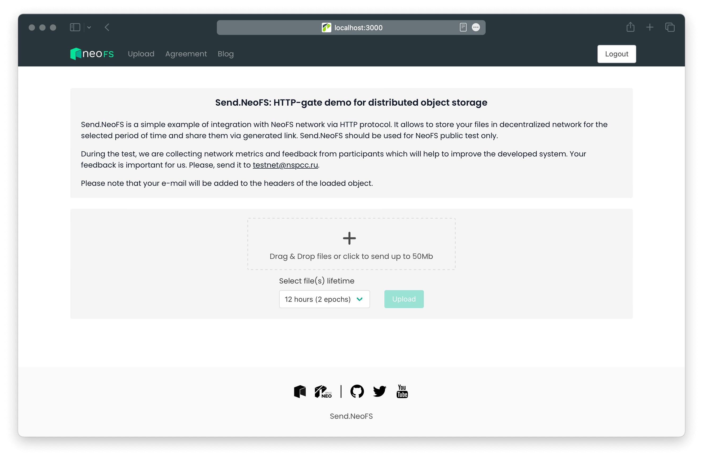

<p align="center">

</p>
<p align="center">
  <a href="https://fs.neo.org">NeoFS</a> is a decentralized distributed object storage integrated with the <a href="https://neo.org">Neo Blockchain</a>.
</p>

---




# Overview

Send.NeoFS is a simple example of integration with NeoFS network via HTTP protocol. It allows to store your files in decentralized network for the selected period of time and share them via generated link. Send.NeoFS should be used for NeoFS public test only.

# Requirements

- docker
- make
- node (`14+`)

# Make instructions

* Compile the build using `make` (will be generated in `send.fs.neo.org` dir)
* Start app using `make start PORT=3000` (PORT=3000 by default)
* Clean up cache directories using `make clean`
* Get release directory with tar.gz using `make release`

Set variables in the `.env` file before executing the commands:
- `REACT_APP_NEOFS` - Path to SendFS
- `REACT_APP_CONTAINER_ID` - NeoFS container ID where the objects would be stored
- `REACT_APP_NETMAP_CONTRACT` - NeoFS netmap contract

# Send.NeoFS local up

 - Start [neofs-dev-env](https://github.com/nspcc-dev/neofs-dev-env)
 - Update `.env`
 - Execute `npm install`
 - Run local `npm start`

# Deployment to production

Two containers are used, one to store website data and another to store
uploaded content. Then nginx is set up to use both for a single website.

 - Create container: `neofs-cli --rpc-endpoint st1.storage.fs.neo.org:8080 --config CONFIG_PATH container create --policy 'REP 2 IN X CBF 1 SELECT 4 FROM F AS X FILTER "Deployed" EQ "NSPCC" AS F' --basic-acl public-read --await`

CONFIG_PATH – path to wallet config, wallet config example:
```
wallet: test.json
address: NWuFifWC3F5R9hY3xHyy9UvAAKxGgZfp4W
password: <secret>
```
 - Update `/bin/upload.py` script with actual `cid`
 - Run `make`
 - Untar archive to separate dir
 - Copy `/bin/upload.py` to dir
 - Run `upload.py` to put send.fs to the NeoFS container
 - Create data container: `neofs-cli container create -r st1.storage.fs.neo.org:8080 --config CONFIG_PATH --basic-acl 0X0fbfbfff --policy 'REP 2 IN X CBF 2 SELECT 2 FROM F AS X FILTER Deployed EQ NSPCC AS F' --await`
 - Create EACL for it: `neofs-cli acl extended create --cid DATA_CID -r 'deny put others' -r 'deny delete others' --out eacl.json`
 - Set EACL for data container: `neofs-cli container set-eacl -r st1.storage.fs.neo.org:8080 --cid DATA_CID --table eacl.json --config CONFIG_PATH --await`
 - Update nginx.config to use new container in the production server

# Nginx config example on the production server

```Nginx
# nginx server configuration for:
#    - https://send.fs.neo.org/

server {
        listen [::]:443 ssl http2;

        ssl_certificate           /etc/nginx/ssl/send.fs.neo.org.crt;
        ssl_certificate_key       /etc/nginx/ssl/send.fs.neo.org.key;
        ssl_protocols             TLSv1.2 TLSv1.3;
        ssl_prefer_server_ciphers on;
        ssl_ciphers               "ECDHE-RSA-AES128-GCM-SHA256:ECDHE-ECDSA-AES128-GCM-SHA256:ECDHE-RSA-AES256-GCM-SHA384:ECDHE-ECDSA-AES256-GCM-SHA384:DHE-RSA-AES128-GCM-SHA256:DHE-DSS-AES128-GCM-SHA256:kEDH+AESGCM:ECDHE-RSA-AES128-SHA256:ECDHE-ECDSA-AES128-SHA256:ECDHE-RSA-AES128-SHA:ECDHE-ECDSA-AES128-SHA:ECDHE-RSA-AES256-SHA384:ECDHE-ECDSA-AES256-SHA384:ECDHE-RSA-AES256-SHA:ECDHE-ECDSA-AES256-SHA:DHE-RSA-AES128-SHA256:DHE-RSA-AES128-SHA:DHE-DSS-AES128-SHA256:DHE-RSA-AES256-SHA256:DHE-DSS-AES256-SHA:DHE-RSA-AES256-SHA:AES128-GCM-SHA256:AES256-GCM-SHA384:ECDHE-RSA-RC4-SHA:ECDHE-ECDSA-RC4-SHA:AES128:AES256:RC4-SHA:HIGH:!aNULL:!eNULL:!EXPORT:!DES:!3DES:!MD5:!PSK"; # TLS cipher suites set: mozilla
        ssl_dhparam               /etc/pki/dhparam/set0;
        ssl_ecdh_curve            secp384r1;
        ssl_stapling              on;
        resolver                  67.207.67.2 67.207.67.3 valid=300s;
        resolver_timeout          5s;
        add_header                Strict-Transport-Security "max-age=63072000; includeSubDomains" always;
        add_header                Content-Security-Policy "frame-ancestors 'none';";
        add_header                X-Content-Type-Options "nosniff" always;
        add_header                X-Frame-Options "DENY" always;
        add_header                X-XSS-Protection "1; mode=block";
        add_header                Referrer-Policy "same-origin";

        server_name send.fs.neo.org;

        root /srv/www/sites/send.fs.neo.org/v0.2.0;

        keepalive_timeout 60;

        access_log /var/log/nginx/send.fs.neo.org-https_access.log;
        error_log /var/log/nginx/send.fs.neo.org-https_error.log;
        index index.html index.htm;

        if (-f $document_root/maintenance.html) {
                return 503;
        }
        error_page 503 @maintenance;
        location @maintenance {
                rewrite ^(.*)$ /maintenance.html break;
        }

        set $cid HPUKdZBBtD75jDN8iVb3zoaNACWinuf1vF5kkYpMMbap;
        set $data_cid 41tVWBvQVTLGQPHBmXySHsJkcc6X17i39bMuJe9wYhAJ;
        set $neofs_http_gateway http.fs.neo.org;

        client_body_buffer_size     10K;
        client_header_buffer_size   1k;
        client_max_body_size        100m;
        large_client_header_buffers 2 1k;
        proxy_connect_timeout       300;
        proxy_send_timeout          300;
        proxy_read_timeout          300;
        send_timeout                300;
        default_type application/octet-stream;

        # Disallow access to hidden files and directories, except `/.well-known/`
        # https://www.mnot.net/blog/2010/04/07/well-known
        # https://tools.ietf.org/html/rfc5785
        location ~ /\.(?!well-known/) {
                return 404;
        }

        location = /favicon.ico {
                try_files /favicon.ico =204;
                access_log off;
                log_not_found off;
        }

        location = /nginx_status {
                stub_status on;
                access_log off;
                allow 127.0.0.1/32;
                allow ::1/128;
                allow 178.62.211.89;
                allow 10.18.0.6;
                allow 10.110.0.2;
                allow 172.17.0.1;
                deny all;
        }

        location ~ "^\/chain" {
                rewrite ^/chain/(.*) /$1 break;
                proxy_pass https://rpc1.morph.fs.neo.org:40341;
        }

        location /gate/upload/ {
                rewrite ^/gate/(.*) /upload/$data_cid break;
                proxy_pass https://$neofs_http_gateway;
                proxy_pass_request_headers      on;
                proxy_set_header X-Attribute-email $http_x_attribute_email;
                proxy_set_header X-Attribute-NEOFS-Expiration-Epoch $http_x_attribute_neofs_expiration_epoch;
        }

        location ~ "^\/gate\/get(/.*)?\/?$" {
                rewrite  ^/gate/get/(.*) /$1 break;
                proxy_pass https://$neofs_http_gateway;

                proxy_intercept_errors on;
                proxy_cache_valid 404 0;
                proxy_cache_valid 200 15m;
                proxy_buffering on;
                proxy_cache neofs_cache;
                proxy_cache_methods GET;
        }

        location /signup_google/ {
                proxy_pass http://localhost:8084/login?service=google;
                proxy_intercept_errors on;
                proxy_buffering on;
                proxy_set_header Host                 $http_host;
                proxy_set_header X-Real-IP            $remote_addr;
                proxy_set_header X-Forwarded-For      $proxy_add_x_forwarded_for;
                proxy_set_header X-Forwarded-Proto    $scheme;
        }

        location /signup_github/ {
                proxy_pass http://localhost:8084/login?service=github;
                proxy_intercept_errors on;
                proxy_buffering on;
                proxy_set_header Host                 $http_host;
                proxy_set_header X-Real-IP            $remote_addr;
                proxy_set_header X-Forwarded-For      $proxy_add_x_forwarded_for;
                proxy_set_header X-Forwarded-Proto    $scheme;
        }

        location ~ "^\/callback" {
               rewrite ^/callback\?(.*) /$1 break;
               proxy_pass http://localhost:8084;
        }

        location /load {
                rewrite '^(/.*)$'                       /get_by_attribute/$cid/FileName/index.html break;
                proxy_pass https://$neofs_http_gateway/;
                include             /etc/nginx/mime.types;
        }

        location /toc {
                rewrite '^(/.*)$'                       /get_by_attribute/$cid/FileName/index.html break;
                proxy_pass https://$neofs_http_gateway/;
                include             /etc/nginx/mime.types;
        }

        location / {
                rewrite '^(/[0-9a-zA-Z\-]{43,44})$' /get/$cid/$1 break;
                rewrite '^/$'                       /get_by_attribute/$cid/FileName/index.html break;
                rewrite '^/([^/]*)$'                /get_by_attribute/$cid/FileName/$1 break;
                rewrite '^(/.*)$'                   /get_by_attribute/$cid/FilePath/$1 break;

                proxy_pass https://$neofs_http_gateway/;
                include             /etc/nginx/mime.types;
        }
}
```

# License

- [GNU General Public License v3.0](LICENSE)
